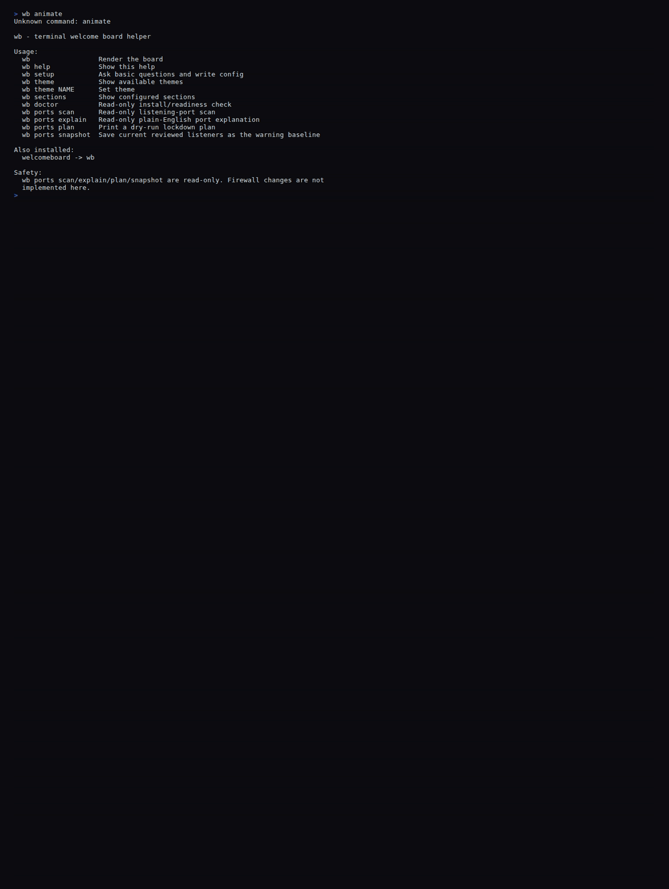
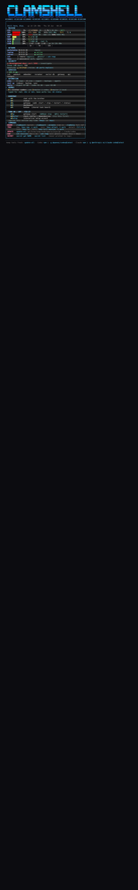

# Clamshell Welcome Board

[](https://github.com/psychofanPLAYS/Clamshell-Welcome-Board/actions/workflows/test.yml)

A fast, beautiful, **single-screen operator board** that prints when you open a terminal — machine pressure, network peers, security drift, services, scheduled automation, and your command cheat-sheet, in one perfectly-aligned frame. Linux **and** macOS. Pure Bash, no daemons, no dependencies beyond what your shell already has.



> Login is **instant and static** (never blocks your prompt). The slam-in animation above is the optional showpiece: `clamboard --animate`.



A public-safe text preview lives in [docs/demo-output.txt](docs/demo-output.txt).

---

## What it shows

One framed board, gold section titles on cyan dividers, zebra-striped rows:

| Section | What it tells you, at a glance |
|---|---|
| **MACHINE** | CPU / GPU / VRAM / RAM / SWAP / DISK / LOAD gauges with live temps & clocks (NVIDIA when present). |
| **NETWORK** | Tailscale peers (real probes — no fake "online"), `ssh` remote-login count, live `tmux` sessions. |
| **SECURITY** | Curated alerts only — unrecognized open ports, drift from a saved baseline. No raw socket dumps. |
| **SERVICES** | Your watched ports as up/down, by friendly name. |
| **AUTOMATION** | Your own scheduled jobs — user `systemd` timers + cron (system jobs excluded). |
| **HERMES** | An example agent-command cheat-sheet (`m1`/`m2` lanes) — customize or drop it. |
| **COMMANDS** | Copy-paste operator commands: tmux, updates, ssh hygiene, secrets. |

**Design rules:** dark-mode, glance-first, and a hard **symmetry law** — every framed line is exactly the same display width (verified in CI by `tests/check_symmetry.py`). Only width-1 glyphs are used inside the frame, so the right edge never drifts on any terminal.

---

## Install in one paste — Codex Or Claude does it

Paste this into **Codex, Claude Code, or any coding agent** and it will install + customize the board for you, safely:

```text
You are helping me install and customize this terminal welcome board:
https://github.com/psychofanPLAYS/Clamshell-Welcome-Board

Do this safely:
1. Clone the repo into a normal projects folder and read README.md + examples/config.example.
2. Ask me for: display name, banner text, service ports to watch (name:port), network peers,
   and whether I want the HERMES agent-shortcuts section.
3. Run ./install.sh, then write my answers into ~/.config/welcome-board/config.
4. Show me which shell-startup lines will be added BEFORE editing ~/.bashrc.
5. Run `wb doctor`, then `wb ports explain` (read-only). Ask before `wb ports snapshot`.
6. Run the tests and a render preview before calling it done.
7. Do NOT change firewall rules, close ports, or edit SSH settings.
```

Full agent brief: **[prompts/install-with-agent.md](prompts/install-with-agent.md)** ·
Packaged skill for skill-aware agents: **[skills/welcome-board-installer/SKILL.md](skills/welcome-board-installer/SKILL.md)**

## Install by hand

```bash
git clone https://github.com/psychofanPLAYS/Clamshell-Welcome-Board.git
cd Clamshell-Welcome-Board
./install.sh           # copies files + prints the shell-hook lines (edits nothing itself)
cp examples/config.example ~/.config/welcome-board/config   # then edit it
```

Add the line `install.sh` prints to the end of your `~/.bashrc` (or `~/.zprofile`):

```bash
[[ $- == *i* ]] && [ -f ~/.local/share/welcome-board/welcome-board.sh ] && source ~/.local/share/welcome-board/welcome-board.sh
```

Open a new terminal — that's it. `wb doctor` (read-only) confirms a healthy install.

---

## Customize

Everything personal lives in `~/.config/welcome-board/config` — see the fully-commented **[examples/config.example](examples/config.example)**. The keys the board reads:

```bash
WB_DISPLAY_NAME="Alex"                       # name in the greeting
WB_BANNER_TEXT="WORKSTATION"                  # big banner word (renders via figlet; CLAMSHELL is the built-in art)
WB_SERVICE_PORTS="ssh:22 webdash:6900 db:6333"   # SERVICES, as name:port
WB_PEERS="laptop|laptop| server|server|10.0.0.20:8080"  # NETWORK peers: label|tailscale-match|probe-ip:port
WB_PORT_BASELINE_FILE="$HOME/.local/state/welcome-board/ports-baseline.txt"
WB_AUTOMATION_LABEL="backups · sync · indexer"   # optional descriptor on the AUTOMATION row
```

Run `wb setup` for an interactive walk-through of the same keys.

## Commands

```bash
clamboard              # reprint the board
clamboard --animate    # play the slam-in showpiece animation
clamhelp               # full command reference
hkeys                  # reprint just the agent-shortcuts box
wb doctor              # read-only install/health check
wb ports explain       # plain-English review of listening ports (read-only)
wb ports snapshot      # save the reviewed baseline SECURITY warns against
```

---

## The animation

`clamboard --animate` (or `WB_ANIMATE=1` at login) slides the banner in from behind the right edge, slams it home, then decodes the binary subtitle left-to-right. It is **synchronous and fast (~0.4s)** and finishes before your prompt returns. The default login render is deliberately static and instant so it never fights your typing or slows a new shell. Regenerate the README GIF with [tools/demo.tape](tools/demo.tape) (via [vhs](https://github.com/charmbracelet/vhs)).

## Cross-platform

- **Linux:** full gauges via `/proc`, `/sys`, `free`, `df`, `nvidia-smi`, `ss`.
- **macOS:** native `sysctl` / `vm_stat` / `df` probes; GPU temps/clocks degrade to "not exposed" gracefully.
- **Bash 3.2 safe** — no `mapfile`, no associative arrays — so macOS's stock `/bin/bash` runs it. CI tests on `ubuntu-latest` **and** `macos-latest`.
- Every probe is wrapped: a missing tool shows `—`, never a crash, and never blocks the prompt.

## Security model

Port features are **read-only**: `wb ports scan | explain | plan | snapshot`. The board never opens, closes, or firewalls anything. `snapshot` writes only a reviewed baseline file used for drift warnings. Details in **[SECURITY.md](SECURITY.md)** and [docs/PORT_SECURITY_MODEL.md](docs/PORT_SECURITY_MODEL.md). Machine names, IPs, and aliases live in your local config — never in committed defaults.

## Extending

The board is a list of small section functions. Add your own (a service row, a graph, a personal integration) using the shell-section contract in **[docs/SECTION_SDK.md](docs/SECTION_SDK.md)**. AI agents editing the board should read [docs/LLM_EXTENSION_GUIDE.md](docs/LLM_EXTENSION_GUIDE.md) first.

## Develop & test

```bash
bash -n welcome-board.sh bin/wb bin/welcomeboard install.sh   # syntax
PYTHONDONTWRITEBYTECODE=1 python3 -m unittest discover -s tests -v   # full suite
bash welcome-board.sh | python3 tests/check_symmetry.py       # prove the frame is symmetric
```

Contribution + verification steps: **[CONTRIBUTING.md](CONTRIBUTING.md)**.

## License

License is not finalized yet. Do not assume redistribution rights until a `LICENSE` file is added.
